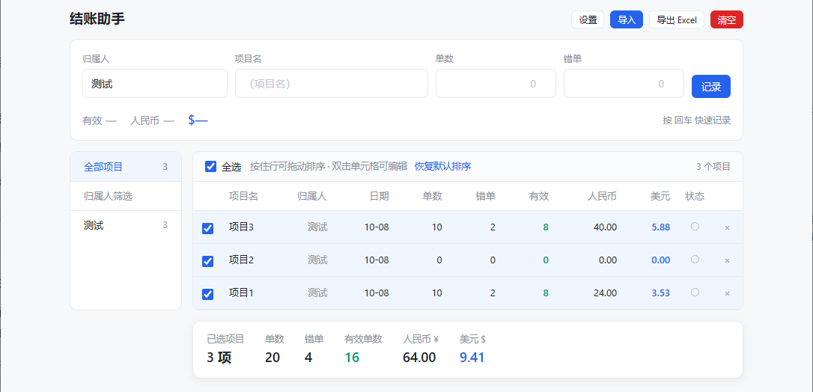

# 结账助手

**离线项目记账工具 · 截图识别导入 · 一键结清**

Windows 桌面软件 · 数据全部保存在本机 · 不联网、不上传

 

点击上方按钮直接下载 · 约 160 MB · 无需安装，解压即用

 
 

 
 

---

## 这是什么

**结账助手**是一款给团队内部使用的**离线记账工具**，用来记录和结清日常项目开支。

把每天的消费记进去，月底按人的归属一键结清，导出 Excel 交给财务——不用装数据库，不用连服务器，**打开就能用**。

> 所有账目数据都保存在你自己的电脑上（`C:\Users\<你的用户名>\AppData\Roaming\结账助手`），
> 软件不联网、不上传、不依赖任何账号。

## 主要功能

| 功能 | 说明 |
|---|---|
| 📝 **快速记账** | 金额、日期、归属人、备注，一行一条，回车即存 |
| 📸 **截图识别导入** | 直接粘贴截图，自动识别金额和项目名（离线 OCR，无需联网） |
| ✅ **一键结清** | 按当前筛选范围批量结清，已结清的行自动灰显、不再计入汇总 |
| 🖱️ **拖动排序** | 按住任意一行即可上下拖动调整顺序 |
| 👤 **归属人筛选** | 侧栏按人筛选、查看各自待结金额 |
| 📊 **导出 Excel** | 一键导出当前列表，直接交给财务 |
| 🔄 **自动更新** | 有新版本自动提示，点一下即可升级（只下载约 120 KB） |
| 🎨 **主题与字号** | 亮色 / 暗色 / 跟随系统，字号三档可调 |

## 下载与安装

### 下载

点击下方按钮，或访问 [最新版本页面](https://github.com/cvrtgbp2dn-code/jiehuan-helper/releases/latest)：

> 💡 这个链接**永远指向最新版**，无需关心版本号，收藏起来随时可用。

### 安装

1. 下载 `checkout-helper-win32-x64.zip`（约 160 MB）
2. 解压到任意目录（建议放在 `D:\结账助手` 或桌面，**不要放在回收站、临时目录**）
3. 双击 `结账助手.exe` 即可运行——**无需安装、无需管理员权限**

### 系统要求

- Windows 10 / 11（64 位）
- 首次启动约需 3～5 秒（内含离线识别引擎）

## 使用说明

### 记账

在输入区填写**金额**、**日期**、**归属人**和**备注**，按回车或点「添加」即可。

### 截图识别

把消费截图直接**粘贴**（`Ctrl+V`）到输入框，软件会自动识别金额与项目名称，识别结果可手动修正。

### 结清

勾选要结清的记录 → 点右侧绿色的「结清」按钮。已结清的记录会**灰显**、不再计入汇总，但仍保留在列表中（可随时恢复未结）。

> 已结清的行默认不勾选，点「全选」也会自动跳过它们。

### 更新

软件**自动检查新版本**并在有更新时提示，点「立即更新」即可（只下载约 120 KB，自动重启生效）。
也可以手动检查：**设置 → 版本 → 检查更新**。

## 常见问题

<b>数据存在哪里？会丢吗？</b>

 

数据保存在 `C:\Users\<你的用户名>\AppData\Roaming\结账助手`，**不在软件目录里**。
所以移动、改名、删除软件文件夹都不影响账目；更新软件也只是替换程序文件，数据完全不受影响。

<b>清空的记录能找回吗？</b>

 

清空后有 **6 秒**的时间可以点「撤销」，过期后不可恢复。建议定期用「导出 Excel」备份。

<b>已结清的项目去哪了？</b>

 

还留在列表里，只是变成灰色并且不再计入汇总。随时可以恢复成未结状态。导出的 Excel 里也包含这些记录。

<b>截图识别不工作？</b>

 

请不要移动或删除软件目录下的 `resources\app.asar.unpacked` 文件夹，识别引擎放在那里。

<b>需要联网吗？会上传我的数据吗？</b>

 

**不需要联网，也不会上传任何数据。** 记账、识别、结清、导出全部在本机完成。
唯一的网络请求是检查更新（只读取一个版本号文件），且不会发送任何账目内容。

<b>提示「安装目录不可写」怎么办？</b>

 

把软件移到桌面或文档目录再试。通常是因为放在了 `C:\Program Files` 等需要管理员权限的位置。

## 更新日志

最新版本的更新内容，请见 [Releases 页面](https://github.com/cvrtgbp2dn-code/jiehuan-helper/releases)。

<b>v5.4</b>（2026-10）

 

- 新增「复制下载链接」：设置 → 安装包，一键复制永久有效的下载链接
- 这条链接永远指向最新版，转发给新同事即可，不用再传压缩包
- 更新弹窗里的「下载完整安装包」也改走这条永久链接

<b>v5.3</b>（2026-10）

 

- 新增表格行拖拽排序，按住任意一行即可上下拖动
- 已结清的行默认不勾选、全选自动跳过，仍可手动勾选
- 结清按钮严格跟随勾选，勾几笔结几笔，0 笔时置灰
- 新增「检查更新」：自动检查新版本，以后不用再传整个压缩包
- 界面上的长说明统一移入帮助中心，软件内只留简短操作提示

## 反馈

使用中遇到问题或有功能建议，欢迎[提交 Issue](https://github.com/cvrtgbp2dn-code/jiehuan-helper/issues)，或直接联系开发者。

---

结账助手 · 内部使用工具 · 数据仅存本机

